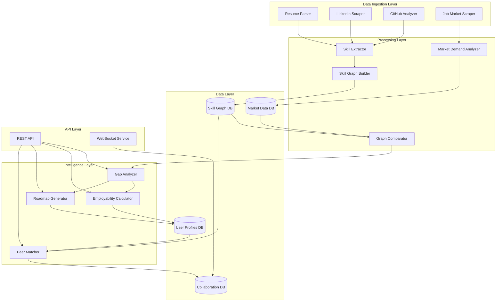

# Design Document: Mindly

## Overview

Mindly is architected as a multi-layered AI-powered platform that transforms unstructured career data into actionable employability intelligence. The system follows a pipeline architecture where data flows through ingestion, extraction, graph construction, analysis, and recommendation stages. At its core, Mindly maintains two parallel graph structures: the user's Skill_Graph and the Market_Demand_Graph, which are continuously compared to generate personalized insights.

The platform leverages modern NLP techniques (transformer-based embeddings, named entity recognition), graph algorithms (similarity scoring, path finding), and machine learning models (skill inference, demand forecasting) to provide measurable, data-driven career guidance. The architecture prioritizes modularity, allowing each component to evolve independently while maintaining clear interfaces.

## Architecture

### High-Level Architecture



### Component Responsibilities

**Data Ingestion Layer:**
- Resume Parser: Extracts text and structure from PDF/DOCX/TXT files
- LinkedIn Scraper: Retrieves profile data via web scraping or API
- GitHub Analyzer: Analyzes repositories, languages, and contribution patterns
- Job Market Scraper: Collects job listings from multiple sources

**Processing Layer:**
- Skill Extractor: Identifies skills using NLP and semantic analysis
- Skill Graph Builder: Constructs and maintains user skill graphs
- Market Demand Analyzer: Processes job listings into demand metrics
- Graph Comparator: Performs structural and semantic comparison between graphs

**Intelligence Layer:**
- Gap Analyzer: Calculates skill gaps and identifies missing competencies
- Employability Calculator: Computes composite employability scores
- Roadmap Generator: Creates personalized learning paths
- Peer Matcher: Identifies compatible learning partners

**Data Layer:**
- User Profiles DB: Stores user metadata, preferences, and history
- Skill Graph DB: Graph database for skill relationships and proficiency
- Market Data DB: Time-series database for job market trends
- Collaboration DB: Tracks peer sessions and outcomes

## Components and Interfaces

### 1. Resume Parser

**Purpose:** Extract structured information from unstructured resume documents.

**Interface:**
```
parse_resume(file: BinaryData, format: FileFormat) -> ParsedResume
  Input: 
    - file: Binary content of resume
    - format: PDF | DOCX | TXT
  Output:
    - ParsedResume containing sections (contact, experience, education, skills)
  Errors:
    - UnsupportedFormatError if format not recognized
    - CorruptedFileError if file cannot be read
```

**Implementation Approach:**
- Use PyPDF2 or pdfplumber for PDF extraction
- Use python-docx for DOCX parsing
- Apply regex patterns to identify section boundaries
- Use NER (Named Entity Recognition) models to extract entities (dates, companies, titles)
- Normalize extracted text (remove special characters, standardize formatting)

### 2. Skill Extractor

**Purpose:** Identify explicit and implicit skills from text using NLP.

**Interface:**
```
extract_skills(text: String, context: ExtractionContext) -> List[SkillMention]
  Input:
    - text: Raw text from resume, job description, or profile
    - context: Metadata about text source (resume, job_listing, github_readme)
  Output:
    - List of SkillMention objects with (skill_name, confidence, span, evidence)
  
infer_skills(job_title: String, description: String) -> List[InferredSkill]
  Input:
    - job_title: Role name (e.g., "Senior Backend Engineer")
    - description: Job or experience description
  Output:
    - List of InferredSkill objects with (skill_name, confidence, reasoning)
```

**Implementation Approach:**
- Maintain a curated skill taxonomy (10,000+ skills across domains)
- Use sentence transformers (e.g., all-MiniLM-L6-v2) to generate embeddings
- Perform semantic similarity matching between text and skill taxonomy
- Apply keyword matching for exact skill mentions
- Use pre-trained NER models fine-tuned on job descriptions
- Implement skill inference rules (e.g., "Python Developer" → Python, Git, Testing)
- Assign confidence scores based on match type (exact > semantic > inferred)

### 3. Skill Graph Builder

**Purpose:** Construct and maintain a graph representation of user skills.

**Interface:**
```
build_skill_graph(skill_mentions: List[SkillMention], user_id: String) -> SkillGraph
  Input:
    - skill_mentions: Extracted skills from various sources
    - user_id: User identifier
  Output:
    - SkillGraph with nodes and edges
    
update_skill_graph(graph: SkillGraph, new_skills: List[SkillMention]) -> SkillGraph
  Input:
    - graph: Existing skill graph
    - new_skills: Newly extracted skills
  Output:
    - Updated SkillGraph with merged information
    
get_skill_proficiency(graph: SkillGraph, skill: String) -> Float
  Input:
    - graph: User's skill graph
    - skill: Skill name
  Output:
    - Proficiency score (0.0 - 1.0)
```

**Graph Structure:**
- Nodes: Skills with attributes (name, proficiency, last_updated, sources, category)
- Edges: Relationships (prerequisite, related_to, part_of) with weights
- Use Neo4j or NetworkX for graph storage and traversal

**Proficiency Calculation:**
- Evidence strength: Multiple mentions increase confidence
- Recency: Recent mentions weighted higher (exponential decay)
- Source credibility: GitHub projects > LinkedIn endorsements > Resume mentions
- Formula: `proficiency = Σ(evidence_weight * recency_factor * source_weight) / normalization_factor`

### 4. Market Demand Analyzer

**Purpose:** Process job listings to understand market skill demand.

**Interface:**
```
analyze_job_listing(listing: JobListing) -> List[MarketSkillDemand]
  Input:
    - listing: Structured job posting data
  Output:
    - List of MarketSkillDemand with (skill, importance, salary_correlation)
    
build_demand_graph(listings: List[JobListing], filters: MarketFilters) -> MarketDemandGraph
  Input:
    - listings: Collection of job postings
    - filters: Role type, location, experience level filters
  Output:
    - MarketDemandGraph showing skill demand patterns
    
get_skill_demand_trend(skill: String, time_window: Duration) -> TrendData
  Input:
    - skill: Skill name
    - time_window: Historical period to analyze
  Output:
    - TrendData with (frequency_over_time, growth_rate, forecast)
```

**Implementation Approach:**
- Extract skills from job descriptions using Skill Extractor
- Calculate demand frequency: `frequency = count(skill in listings) / total_listings`
- Identify skill clusters using co-occurrence analysis
- Correlate skills with salary data using regression analysis
- Compute growth trends using time-series analysis (moving averages)
- Store demand data with timestamps for historical tracking

### 5. Gap Analyzer

**Purpose:** Compare user skills against market demand to identify gaps.

**Interface:**
```
calculate_skill_gap(user_graph: SkillGraph, market_graph: MarketDemandGraph, target_role: String) -> SkillGapAnalysis
  Input:
    - user_graph: User's skill graph
    - market_graph: Market demand graph
    - target_role: Desired job role
  Output:
    - SkillGapAnalysis with (gap_score, missing_skills, surplus_skills, cluster_gaps)
    
rank_missing_skills(gaps: SkillGapAnalysis) -> List[RankedSkill]
  Input:
    - gaps: Skill gap analysis results
  Output:
    - List of RankedSkill sorted by importance (demand * impact on employability)
```

**Gap Score Calculation:**
```
For each required skill in target role:
  If skill present in user_graph:
    gap_contribution = max(0, required_proficiency - user_proficiency) * skill_weight
  Else:
    gap_contribution = required_proficiency * skill_weight
    
skill_gap_score = 100 * (1 - Σ(gap_contribution) / Σ(skill_weight))
```

**Skill Importance Ranking:**
- Weight by demand frequency in target role
- Weight by salary correlation
- Weight by prerequisite position (foundational skills ranked higher)
- Consider skill acquisition difficulty (time investment)

### 6. Employability Calculator

**Purpose:** Compute a composite score representing overall job readiness.

**Interface:**
```
calculate_employability_index(user_graph: SkillGraph, market_graph: MarketDemandGraph, profile: UserProfile) -> EmployabilityIndex
  Input:
    - user_graph: User's skill graph
    - market_graph: Market demand graph
    - profile: User metadata (experience, education, location)
  Output:
    - EmployabilityIndex with (overall_score, component_scores, percentile_rank)
    
get_index_breakdown(index: EmployabilityIndex) -> IndexBreakdown
  Input:
    - index: Calculated employability index
  Output:
    - IndexBreakdown showing contribution of each factor
```

**Index Calculation:**
```
Components:
1. Skill Coverage (40%): Percentage of in-demand skills possessed
2. Skill Proficiency (25%): Average proficiency in possessed skills
3. Market Alignment (20%): Overlap with trending/high-value skills
4. Experience Level (10%): Years of relevant experience
5. Skill Recency (5%): How recently skills were demonstrated

employability_index = Σ(component_score * component_weight)

Normalization: Scale to 0-100 range using percentile ranking across user base
```

### 7. Roadmap Generator

**Purpose:** Create personalized learning paths to close skill gaps.

**Interface:**
```
generate_roadmap(gaps: SkillGapAnalysis, user_graph: SkillGraph, preferences: LearningPreferences) -> LearningRoadmap
  Input:
    - gaps: Identified skill gaps
    - user_graph: Current skill state
    - preferences: Time availability, learning style, priorities
  Output:
    - LearningRoadmap with ordered skill targets and resources
    
estimate_skill_acquisition_time(skill: String, current_proficiency: Float, target_proficiency: Float) -> Duration
  Input:
    - skill: Skill to acquire
    - current_proficiency: Starting proficiency (0.0 if new)
    - target_proficiency: Desired proficiency level
  Output:
    - Estimated time investment in hours
```

**Roadmap Generation Algorithm:**
1. Rank missing skills by importance (from Gap Analyzer)
2. Build dependency graph (identify prerequisites)
3. Perform topological sort to sequence skills
4. Estimate time for each skill based on complexity and current proficiency
5. Group skills into milestones (weekly/monthly targets)
6. Attach resources: peer matches, documentation, project ideas

**Time Estimation:**
- Maintain skill complexity database (beginner/intermediate/advanced)
- Base estimates: Beginner skill = 20-40 hours, Advanced = 100-200 hours
- Adjust for user's learning velocity (track historical progress)
- Consider skill transferability (related skills reduce learning time)

### 8. Peer Matcher

**Purpose:** Identify compatible peers for mutual skill development.

**Interface:**
```
find_peer_matches(user_id: String, target_skill: String, filters: MatchFilters) -> List[PeerMatch]
  Input:
    - user_id: User seeking to learn
    - target_skill: Specific skill to develop
    - filters: Availability, location, communication preferences
  Output:
    - List of PeerMatch with (peer_id, match_score, mutual_benefit, explanation)
    
calculate_match_score(user_a: SkillGraph, user_b: SkillGraph) -> Float
  Input:
    - user_a: First user's skill graph
    - user_b: Second user's skill graph
  Output:
    - Match score (0.0 - 1.0) indicating compatibility
```

**Matching Algorithm:**
```
For each potential peer:
  1. Skill Complementarity: Does peer have target skill at high proficiency?
     complementarity_score = peer_proficiency(target_skill)
  
  2. Mutual Benefit: Can user help peer with their gaps?
     mutual_benefit_score = max(user_proficiency(peer_gap_skills))
  
  3. Skill Overlap: Shared skills enable better communication
     overlap_score = |user_skills ∩ peer_skills| / |user_skills ∪ peer_skills|
  
  4. Experience Compatibility: Similar experience levels work better
     experience_score = 1 - |user_experience - peer_experience| / max_experience
  
  match_score = 0.4 * complementarity + 0.3 * mutual_benefit + 0.2 * overlap + 0.1 * experience
  
Filter: match_score > threshold (e.g., 0.6)
Rank: Sort by match_score descending
```

### 9. Collaboration Manager

**Purpose:** Facilitate structured peer learning sessions.

**Interface:**
```
create_collaboration_session(user_a: String, user_b: String, target_skills: List[String]) -> CollaborationSession
  Input:
    - user_a, user_b: Matched peer IDs
    - target_skills: Skills to focus on
  Output:
    - CollaborationSession with agenda, milestones, tracking
    
track_session_progress(session_id: String, updates: ProgressUpdate) -> SessionStatus
  Input:
    - session_id: Session identifier
    - updates: Completed activities, skill improvements
  Output:
    - SessionStatus with completion percentage and next steps
    
collect_session_feedback(session_id: String, feedback: SessionFeedback) -> void
  Input:
    - session_id: Session identifier
    - feedback: Ratings, comments, skill endorsements
```

**Session Structure:**
- Pre-session: Define learning objectives, share resources
- Session: Structured agenda (intro, teaching, practice, Q&A)
- Post-session: Skill updates, endorsements, feedback collection
- Templates: Provide session guides based on skill type (coding, design, soft skills)

## Data Models

### User Profile
```
UserProfile {
  user_id: UUID
  email: String
  name: String
  location: String
  experience_years: Float
  education: List[Education]
  preferences: UserPreferences
  created_at: Timestamp
  updated_at: Timestamp
}

Education {
  institution: String
  degree: String
  field_of_study: String
  start_date: Date
  end_date: Date
}

UserPreferences {
  target_roles: List[String]
  learning_time_per_week: Integer (hours)
  collaboration_preference: Boolean
  visibility: Enum[PUBLIC, PEERS_ONLY, PRIVATE]
}
```

### Skill Graph
```
SkillNode {
  skill_id: UUID
  skill_name: String
  canonical_name: String
  category: Enum[TECHNICAL, SOFT_SKILL, DOMAIN_KNOWLEDGE, TOOL, LANGUAGE]
  proficiency: Float (0.0 - 1.0)
  confidence: Float (0.0 - 1.0)
  sources: List[SkillSource]
  last_updated: Timestamp
  verified: Boolean
}

SkillSource {
  source_type: Enum[RESUME, LINKEDIN, GITHUB, PEER_ENDORSEMENT, ASSESSMENT]
  evidence: String
  timestamp: Timestamp
  weight: Float
}

SkillEdge {
  from_skill: UUID
  to_skill: UUID
  relationship: Enum[PREREQUISITE, RELATED_TO, PART_OF, ENABLES]
  weight: Float
}
```

### Market Demand Graph
```
MarketSkillNode {
  skill_id: UUID
  skill_name: String
  demand_frequency: Float (0.0 - 1.0)
  growth_rate: Float (percentage)
  avg_salary_correlation: Float
  trending: Boolean
  role_associations: List[RoleAssociation]
  last_updated: Timestamp
}

RoleAssociation {
  role_name: String
  importance: Float (0.0 - 1.0)
  required_proficiency: Float (0.0 - 1.0)
  frequency: Integer (count in job listings)
}

JobListing {
  listing_id: UUID
  title: String
  company: String
  location: String
  experience_level: Enum[ENTRY, MID, SENIOR, LEAD]
  salary_range: SalaryRange
  required_skills: List[String]
  preferred_skills: List[String]
  posted_date: Date
  source: String
}
```

### Analysis Results
```
SkillGapAnalysis {
  user_id: UUID
  target_role: String
  gap_score: Float (0 - 100)
  missing_skills: List[MissingSkill]
  surplus_skills: List[String]
  cluster_gaps: List[ClusterGap]
  calculated_at: Timestamp
}

MissingSkill {
  skill_name: String
  importance: Float
  required_proficiency: Float
  current_proficiency: Float (0.0 if absent)
  estimated_learning_time: Integer (hours)
}

ClusterGap {
  cluster_name: String
  skills_in_cluster: List[String]
  coverage_percentage: Float
  priority: Enum[HIGH, MEDIUM, LOW]
}

EmployabilityIndex {
  user_id: UUID
  overall_score: Float (0 - 100)
  percentile_rank: Float (0 - 100)
  component_scores: ComponentScores
  historical_scores: List[HistoricalScore]
  calculated_at: Timestamp
}

ComponentScores {
  skill_coverage: Float
  skill_proficiency: Float
  market_alignment: Float
  experience_level: Float
  skill_recency: Float
}
```

### Collaboration Data
```
PeerMatch {
  user_id: UUID
  peer_id: UUID
  match_score: Float (0.0 - 1.0)
  target_skill: String
  mutual_benefit_skills: List[String]
  explanation: String
  created_at: Timestamp
}

CollaborationSession {
  session_id: UUID
  participants: List[UUID]
  target_skills: List[String]
  status: Enum[SCHEDULED, IN_PROGRESS, COMPLETED, CANCELLED]
  agenda: SessionAgenda
  milestones: List[Milestone]
  start_time: Timestamp
  end_time: Timestamp
  feedback: List[SessionFeedback]
}

SessionFeedback {
  from_user: UUID
  rating: Integer (1-5)
  skill_endorsements: List[String]
  comments: String
  would_collaborate_again: Boolean
}
```

